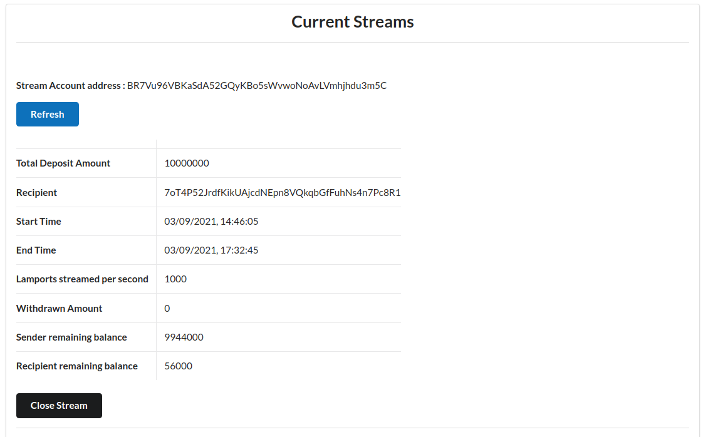

<p align="center">
  <a href="https://solana.com">
    
  </a>
</p>

<!-- [![Build status][travis-image]][travis-url] [](https://gitpod.io/#https://github.com/solana-labs/example-helloworld)

[travis-image]:
https://travis-ci.org/solana-labs/example-helloworld.svg?branch=master
[travis-url]: https://travis-ci.org/solana-labs/example-helloworld -->

# Streaming Payments on Solana

This project demonstrates the Streaming payments project on Solana built in **building-out-loud Solana Hackathon**. 


The project comprises of:

* An on-chain streaming payments program (program/)
* A react client application to demonstrate the working of the program with an easy to use UI (client/) 

Demo video is available <a href="https://vimeo.com/597140717"> here</a>.
Devfolio Submission is available <a href="https://devfolio.co/submissions/solana-streams-c967" >here</a> 

## Motivation

As a worker in web3 world, monthly payments/subscriptions doesn't make sense anymore. With everything becoming decentralized and automated, streaming payments can be used to enable plethora of new applications that were not possible before. No need to wait for month end to get the salary anymore. Withdraw payments anytime. Don't feel like continuing the subscription in the middle of the month? no problem. Cancel payments anytime. With Solana Streams, each second makes you richer giving you more control on your money. 

## Features 

Following features are implemented in this project - 
- Create Streams - Sender can create streams of SOL by specifying total amount, duration of streaming payments, and the recipient. 
- Withdraw money from the stream - The recipient of the stream can view it's real-time withdrawable balance and can withdraw it anytime. 
- Closing the stream - If the service is no longer required, Sender can close the stream whenever required and the deposit amount gets distributed between the sender and recipient based on the distribution at the time of closing.

## Demo 

- Creating streaming payments is super easy with Solana Streams - 
<div style="text-align:center"></div>

 - The stream is created and stored on the blockchain - 
<div style="text-align:center"></div>

- All the information about the stream, including initial deposit amount, start time, end time, tokens released per second, withdrawn amount, recipient, etc is visible in the dashboard - 

<div style="text-align:center"></div>

- The recipient can monitor the real-time withdrawable balance in the stream and easily withdraw whenever required - 
<div style="text-align:center"></div>


## Setting up the project 

to setup the project, follow the following guide - 

1. Start local solana validator -  
```bash
$ solana-test-validator
```

2. deploy program - 

deploy the program on the validator using the following command - 

```bash
$ npm run deploy
```

3. Running React Client - 

first run `npm install` inside the client/ directory. Once packages are installed, run - 

```bash
$ npm run start
```

open the browser and go to localhost:3000/ to test the app. 

## Solana Programs structure 

program/ directory contains the rust programs that are deployed to the blockchain. Following are the different files present - 

- lib.rs - This is the entrypoint for our program, and contains the main business logic for creating streaming payments.
- instructions.rs - Helps in decoding the instructions. 
- state.rs - Defines the state object stored in the program-owned stream account. 
- errors.rs - Defines the list of errors used in the program.


